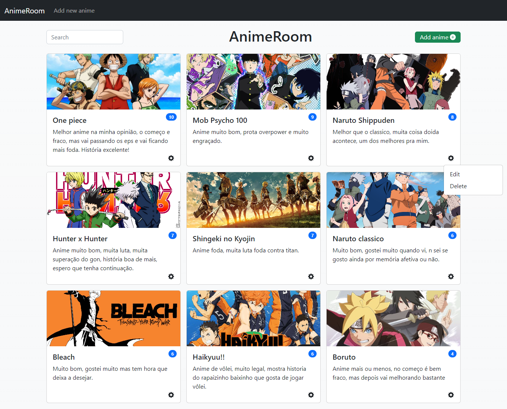
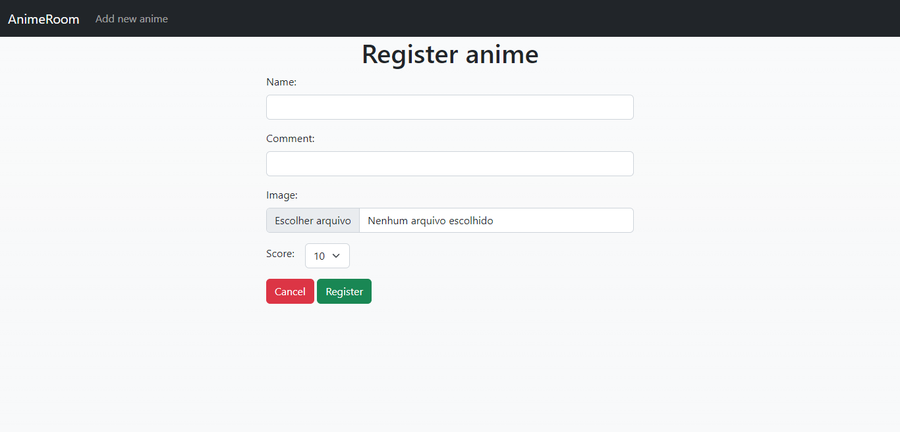
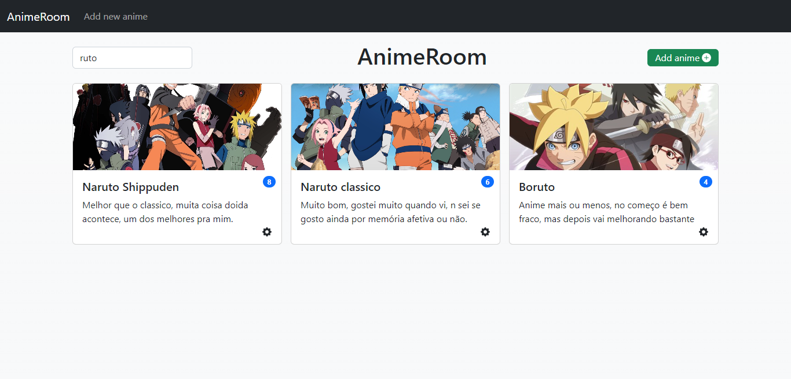

# AnimeRoom

Esse projeto foi um simples crud com Laravel para treinar meus conhecimentos com o framework PHP. Usando o que sei até agora, rotas, views, blade, migrations, api, dentre outras coisas que são disponibilizadas no Laravel.

## Página inicial

A tela inicial lista todos os animes cadastrados no banco, mostrando a imagem, nome, comentário sobre o anime, e nota.

## Tela de cadastrar anime

Na tela de cadastrar um novo anime, deve se passar as informações de devido anime, tais como nome, comentário, imagem e nota.

## Procurar animes na lista

Na tela inicial tem um campo onde pode-se procurar os animes cadastrados, conforme o que digita vai alterando a lista de animes.

## O que desenvolvi com esse projeto

Com esse projeto pude desenvolver mais minhas habilidades com o Laravel, desde mexer com o blade na parte mais do Front-end quanto nos controllers e rotas com a parte mais do Back-end. 
Também aprendi mais como usar a documentação da ferramenta, procurando métodos mais assertivos de forma mais rápida.
